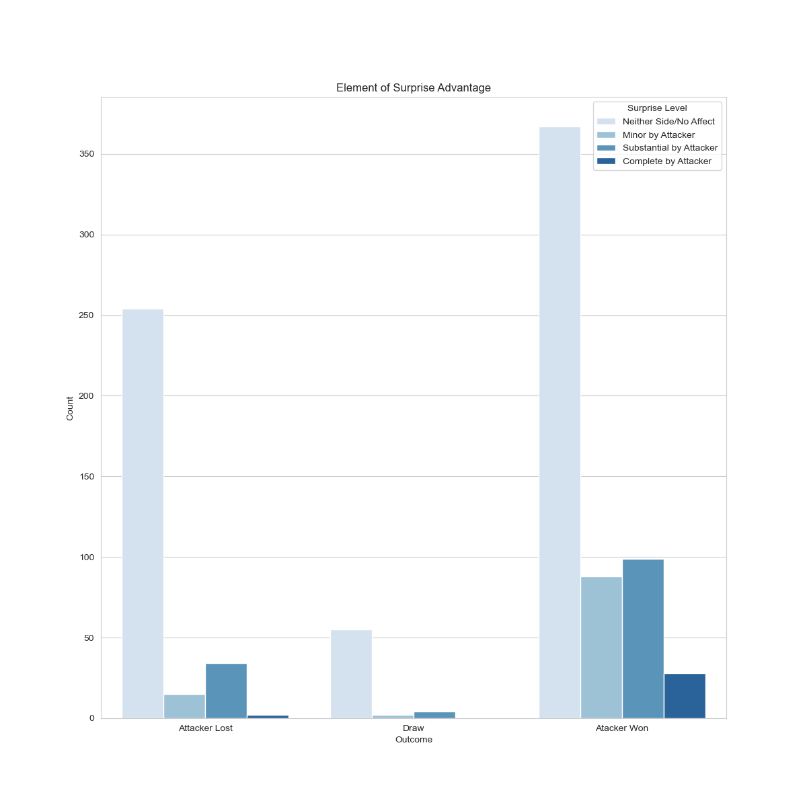

# ARES System &nbsp;&nbsp;

The **A**ssessment of **R**etrospective **E**ngagement **S**cenarios or ARES System is a work in progress that aims to analyze prior engagements throughout different wars in history
and try to find patterns between the outcomes of those engagements and the factors that composed the battle.

### Dataset Information
Bilogur, A. (2017, September). Historical Military Battles, Version 1.
Retrieved May, 17th 2024 from https://www.kaggle.com/datasets/residentmario/database-of-battles/version/1.

### Dataset Overview
+ The dataset is taken from **kaggle** and contains detailed information about **various battles that occurred throughout history**
+ There is a lot of information in this dataset (especially with regards to the number of columns in the *battles.csv* file)
  as such a decent amount of cleaning is needed to make this dataset more manageable.
+ There was also an issue with results of battles missing that were supposed to be *-1* to indicate defeat had occurred.

### Sample Datasets
***
__*battles.csv*__
|isqno|war                             |name          |locn            |campgn       |postype|post1|post2|front|depth|time|aeroa|surpa|cea|leada|trnga|morala|logsa|momnta|intela|techa|inita|wina|kmda|crit|quala|resa|mobila|aira|fprepa|wxa|terra|leadaa|plana|surpaa|mana|logsaa|fortsa|deepa|is_hero|war2                            |war3                            |war4                          |war4_theater|dbpedia                                             |cow_warno|cow_warname|war_initiator|parent|
|-----|--------------------------------|--------------|----------------|-------------|-------|-----|-----|-----|-----|----|-----|-----|---|-----|-----|------|-----|------|------|-----|-----|----|----|----|-----|----|------|----|------|---|-----|------|-----|------|----|------|------|-----|-------|--------------------------------|--------------------------------|------------------------------|------------|----------------------------------------------------|---------|-----------|-------------|------|
|1    |NETHERLAND'S WAR OF INDEPENDENCE|NIEUPORT      |SPANISH FLANDERS|NIEUPORT 1600|0      |HD   |     |0    |0    |0   |0    |0    |   |     |0    |0     |0    |1     |0     |0    |1    |    |    |1   |     |    |0     |0   |0     |0  |0    |      |0    |0     |0   |0     |0     |0    |1      |NETHERLAND'S WAR OF INDEPENDENCE|NETHERLAND'S WAR OF INDEPENDENCE|Eighty Years War of 1568-1648 |            |http://dbpedia.org/resource/Battle_of_Nieuwpoort    |         |           |0            |      |
|2    |THIRTY YEAR'S WAR               |WHITE MOUNTAIN|BOHEMIA         |BOHEMIA 1620 |1      |HD   |PD   |1    |0    |0   |0    |0    |0  |0    |0    |0     |0    |1     |0     |0    |1    |1   |1   |1   |1    |1   |0     |0   |0     |0  |     |1     |0    |0     |0   |0     |      |0    |1      |THIRTY YEAR'S WAR               |THIRTY YEAR'S WAR               |Thirty Years' War of 1618-1648|            |http://dbpedia.org/resource/Battle_of_White_Mountain|         |           |0            |      |
***
__*weather.csv*__
|isqno|wxno|wx1|wx2|wx3|wx4|wx5|
|-----|----|---|---|---|---|---|
|1    |1   |D  |S  |T  |S  |T  |
|2    |1   |D  |S  |T  |W  |T  |
|3    |1   |D  |S  |H  |$  |T  |
|4    |1   |D  |S  |T  |$  |T  |
|5    |1   |D  |S  |T  |S  |T  |
***

### Project Contents
__*The main folder contains 3 folders.*__

  - Folders analysisOne and analysisTwo contain the **python scripts** along with the **Plots** for the corresponding analysis.
  - Folder **[data](data)** contains all the .csv files utilized within ARES.

  ***

# Analyses
### **Analysis 1** (Accuracy: 0.840 +/-0.024) 
[analysisOne.py](analysisOne/analysisOne.py)&emsp;[plots](analysisOne/plots)

- This analysis shows the most influential factors to victory or defeat.
- The **Bar Plot** was created after having cleaned the dataset a bit.
- Some slight issues occurred as not every post would have two types, as such there is an instance for **post2_missing** to indicate that fact.

> Bar Plot of the features and their respective weights to the outcome of the battle after cleaning the dataset.

### **Analysis 2** (Accuracy: 0.638) 
[analysisTwo.py](analysisTwo/analysisTwo.py)&emsp;[plots](analysisTwo/plots)

- This analysis focuses more in depth on factors to the battle's outcome such as weather, terrain, element of surprise, and the fortification. *(Others will be provided in the [plots](analysisTwo/plots) folder for sake of brevity)*

| Defense 1 | Defense 2 |
| --- | --- |
|  |  |

> These count plots above show that in the first posture if a defense was hastily created, the attacker would typically win the engagement (given no external context such as attacker numbers vs. defender numbers). Below is a count plot that shows the occurrences of different surprise levels and their impacts on the outcome of the engagement.

***
# Conclusion
__*Analysis 1*__

- The 5 most influential features to the outcome of the battle were as follows:
  1. **kmda** - Distance Attacker Advanced/Retreated (in Kilometers)
  2. **leadaa** - Degree of Influence of Leadership
  3. **plana** - Degree of Influence of Planning
  4. **resa** - Degree of Influence of Reserves
  5. **leada** - Attacker's Relative Leadership Advantage

__*Analysis 2*__

- Certain features do not show the proper impact on the battle outcome when isolated from other features which is to be expected given that a prepared defense will likely be easier to break if the army size attacking it is larger than the size of the defending army.
- Keeping with the prior sentiment for this analysis, accuracy for testing was fairly consistent yet remained lower than I would have liked it to be.

***